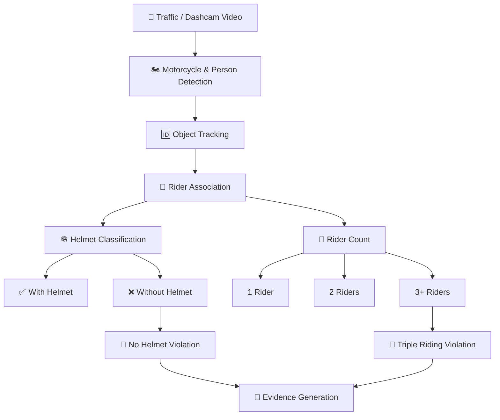

# 🪖 Helmet Violation Detection System

> AI-powered traffic surveillance system for detecting helmet violations and triple riding from traffic and dashcam footage.

## 📌 Overview

The **Helmet Violation Detection System** is a computer vision project that analyzes traffic video and identifies motorcycle-related violations.

The system combines:

- 🏍️ Motorcycle detection
- 👤 Rider detection
- 🆔 Motorcycle and rider tracking
- 🔗 Rider-to-motorcycle association
- 🪖 Helmet classification
- 🚨 No-helmet violation detection
- 👥 Triple-riding detection
- ⏱️ Temporal verification
- 📸 Evidence generation

The project is designed for traffic-monitoring and dashcam scenarios, including rear-view footage where motorcycles are observed from behind.

---

## ✨ Features

| Feature | Description |
|---|---|
| 🏍️ Motorcycle Detection | Detects motorcycles in traffic footage |
| 👤 Rider Detection | Detects people riding motorcycles |
| 🆔 Object Tracking | Tracks motorcycles and riders across frames |
| 🔗 Rider Association | Associates riders with the correct motorcycle |
| 🪖 Helmet Detection | Classifies riders as with or without a helmet |
| 🚨 No Helmet Detection | Identifies riders without helmets |
| 👥 Triple Riding Detection | Detects motorcycles carrying three or more riders |
| ⏱️ Temporal Verification | Uses multiple frames to improve reliability |
| 📸 Evidence Generation | Saves evidence images for confirmed violations |
| 🎥 Dashcam Processing | Supports traffic and dashcam video |

---

## 🧠 System Workflow



### Violation Logic

**No Helmet**

```text
Rider
  ↓
Helmet Classification
  ↓
Without Helmet
  ↓
No Helmet Violation
  ↓
Evidence
```

**Triple Riding**

```text
Motorcycle
  ↓
Rider Association
  ↓
Rider Count
  ↓
3 or more Riders
  ↓
Triple Riding Violation
  ↓
Evidence
```

---

## 🪖 Helmet Detection

The project uses a custom-trained helmet model with two classes:

- **With Helmet**
- **Without Helmet**

Helmet predictions are associated with individual riders.

Example:

```text
Bike ID 380

Rider ID 293 → With Helmet
Rider ID 450 → Without Helmet
```

The system uses confidence thresholds and temporal information to reduce unreliable single-frame decisions.

---

## 👥 Triple Riding Detection

Triple riding is detected when **three or more riders are associated with the same motorcycle**.

```text
1 Rider  → Normal
2 Riders → Normal
3+ Riders → Triple Riding Violation
```

Rider counting is performed after motorcycle/person detection and rider association.

This helps prevent unrelated people near a motorcycle from automatically being counted as riders.

---

## 🎯 Tracking & Rider Association

The system assigns IDs to motorcycles and riders and follows them across consecutive frames.

Example:

```text
Bike ID 380
├── Rider ID 293
└── Rider ID 450
```

Tracking is used for:

- Persistent object identification
- Rider association
- Temporal verification
- Violation confirmation
- Evidence generation

---

## 📸 Evidence Generation

When a violation is confirmed, the system saves an evidence image.

Evidence is stored in:

```text
outputs/evidence/
```

Example:

```text
bike_380_No_Helmet_20260808_171515.jpg
bike_9_Triple_Riding_20260808_185504.jpg
```

The filename identifies the motorcycle, violation type, and timestamp.

---

## 📊 Current Model Performance

The custom helmet model was evaluated on a validation dataset.

| Class | Precision | Recall | mAP@50 | mAP@50-95 |
|---|---:|---:|---:|---:|
| With Helmet | 0.695 | 0.846 | 0.823 | 0.480 |
| Without Helmet | 0.603 | 0.739 | 0.704 | 0.401 |
| **Overall** | **0.649** | **0.793** | **0.763** | **0.440** |

The current model performs better on **With Helmet** detection than **Without Helmet** detection.

Future training can focus on rear-view footage, small riders, occlusion, motion blur, and difficult lighting conditions.

---

## 🎥 Camera Perspective

The system is designed for traffic surveillance footage.

### Rear-view Dashcam

```text
        Dashcam
           ↓
       👤 Rider
       👤 Rider
        🏍️ Bike
```

Rear-view processing is particularly important for real-world dashcam deployment because the camera commonly observes motorcycles from behind.

The system has also been tested with front-view motorcycle footage.

---

## 🗂️ Project Structure

```text
HelmetViolationProject/
│
├── data/
│   └── test_videos/
│
├── models/
│   └── helmet/
│
├── outputs/
│   └── evidence/
│
├── src/
│   ├── association.py
│   ├── check_gpu.py
│   ├── check_model.py
│   ├── detector.py
│   ├── evidence.py
│   ├── extract_rider_crops.py
│   ├── helmet_detector.py
│   ├── main.py
│   ├── video_processor.py
│   ├── video_reader.py
│   ├── violation_engine.py
│   ├── visualizer.py
│   └── utils/
│
├── .gitignore
├── README.md
└── requirements.txt
```

---

## 🛠️ Technology Stack

### Programming
- Python

### Computer Vision
- OpenCV
- NumPy

### Deep Learning
- PyTorch
- YOLO

### AI / Computer Vision Pipeline
- Object Detection
- Object Tracking
- Rider Association
- Helmet Classification
- Temporal Verification
- Violation Detection
- Evidence Generation

---

## ⚙️ Installation

### 1. Clone the repository

```bash
git clone <YOUR-GITHUB-REPOSITORY-URL>
cd HelmetViolationProject
```

### 2. Create a virtual environment

**Windows:**

```powershell
python -m venv .venv
```

**Linux / macOS:**

```bash
python3 -m venv .venv
```

### 3. Activate the environment

**Windows PowerShell:**

```powershell
.venv\Scripts\Activate.ps1
```

**Linux / macOS:**

```bash
source .venv/bin/activate
```

### 4. Install dependencies

```bash
pip install -r requirements.txt
```

---

## ▶️ Running the Project

Place the input traffic video inside:

```text
data/test_videos/
```

Configure the input video path in:

```text
src/main.py
```

Run:

```powershell
python src/main.py
```

The system processes the video and generates detection results and violation evidence.

---

## 📁 Output

Generated evidence is stored in:

```text
outputs/evidence/
```

Example:

```text
Bike 492 Rider ID 450: Without Helmet (0.728)

Evidence saved:
outputs/evidence/bike_492_No_Helmet_20260808_185504.jpg
```

Triple-riding example:

```text
Evidence saved:
outputs/evidence/bike_9_Triple_Riding_20260808_185504.jpg
```

---

## 🧪 Testing

The system has been tested with footage containing:

- Single riders
- Two riders
- Multiple motorcycles
- Riders with helmets
- Riders without helmets
- Triple-riding scenarios
- Front-view motorcycles
- Rear-view motorcycles
- Moving traffic
- Partially occluded riders
- Different motorcycle distances

---

## 🔧 Model Training

The helmet model can be retrained using a dataset containing:

```text
With Helmet
Without Helmet
```

Example YOLO training command:

```bash
yolo detect train model=<base-model>.pt data=<dataset>.yaml epochs=200 imgsz=640
```

Model quality should be evaluated using validation metrics such as:

- Precision
- Recall
- mAP@50
- mAP@50-95

Increasing the number of epochs alone does not guarantee better real-world performance.

---

## ⚠️ Current Limitations

### Small Objects
Riders and helmets become difficult to detect when motorcycles are far from the camera.

### Occlusion
Riders can partially block each other, especially in dense traffic and multi-rider situations.

### Motion Blur
Fast-moving motorcycles can produce blurred rider and helmet regions.

### Lighting
Performance may decrease under low light, strong shadows, backlighting, or night conditions.

### Viewing Angle
Helmet classification can become difficult from unusual camera angles.

### Rider Association
People standing or walking close to motorcycles can sometimes create association challenges.

---

## 🚀 Future Improvements

- [ ] Improve helmet detection dataset
- [ ] Add more rear-view training samples
- [ ] Improve small-object detection
- [ ] Improve rider association
- [ ] Improve temporal verification
- [ ] Automatic number plate detection
- [ ] Number plate OCR
- [ ] Violation database
- [ ] Web monitoring dashboard
- [ ] Real-time CCTV support
- [ ] Real-time camera streaming
- [ ] Automated violation reports
- [ ] Cloud evidence storage
- [ ] Multi-camera support
- [ ] Traffic analytics
- [ ] Vehicle speed estimation
- [ ] Lane detection
- [ ] Edge-device deployment

---

## 📌 Project Status

### Completed

- [x] Motorcycle detection
- [x] Person/rider detection
- [x] Motorcycle tracking
- [x] Rider tracking
- [x] Rider association
- [x] Helmet classification
- [x] No Helmet detection
- [x] Triple Riding detection
- [x] Temporal violation verification
- [x] Evidence generation
- [x] Dashcam testing

### Planned

- [ ] Number plate recognition
- [ ] OCR
- [ ] Database integration
- [ ] Web dashboard
- [ ] Real-time deployment
- [ ] Multi-camera support
- [ ] Automated reporting

---

## 🎓 Project Objective

The objective of this project is to demonstrate how **deep learning, computer vision, object tracking, and intelligent decision-making** can be combined to build an automated traffic-rule monitoring system.

The complete pipeline is:

```text
Object Detection
      ↓
Object Tracking
      ↓
Rider Association
      ↓
Helmet Classification
      ↓
Temporal Verification
      ↓
Violation Detection
      ↓
Evidence Generation
```

The project provides a foundation for intelligent transportation and automated traffic surveillance applications.

---

## 🔐 Repository Management

Large or generated files should not be committed to Git.

Typical ignored files include:

```text
.venv/
__pycache__/
outputs/
*.pt
*.pth
*.onnx
*.mp4
datasets/
```

This keeps the GitHub repository focused on source code, documentation, and project configuration.

---

## 👨‍💻 Author

**Helmet Violation Detection System**

An academic computer vision and intelligent transportation project.

---

## ⭐ Support

If you find this project useful, consider giving the repository a ⭐ on GitHub.
