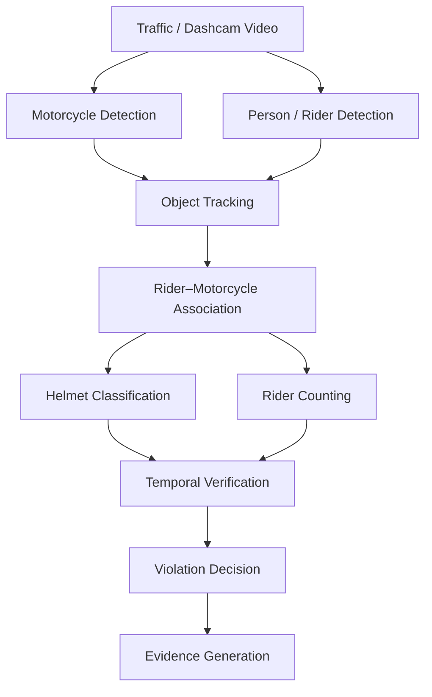

# MOTIVE

### Motorcycle-Oriented Traffic Violation Identification and Evidence

> An AI-driven computer vision framework for motorcycle traffic monitoring, rider analysis, violation detection, and evidence generation.

## Abstract

**MOTIVE** is a research-oriented computer vision framework designed to analyze motorcycle traffic video and identify safety-related violations.

Rather than treating helmet detection as an isolated classification problem, MOTIVE is designed as a multi-stage video-understanding pipeline combining motorcycle detection, rider/person detection, object tracking, rider–motorcycle association, helmet classification, temporal verification, rider counting, and automated evidence generation.

The framework is intended to evolve toward pose-aware rider analysis for challenging traffic scenes, rear-view dashcam footage, occlusion, multiple riders, and small or distant motorcycles.

The long-term objective is to develop a unified framework capable of supporting multiple motorcycle traffic violations while maintaining reliable association between a violation and the correct motorcycle and rider.

---

## Research Motivation

Automated traffic monitoring is not simply a detection problem. A practical system must answer:

1. Where is the motorcycle?
2. Who is actually riding it?
3. Which rider belongs to which motorcycle?
4. Is the rider wearing a helmet?
5. How many riders are on the motorcycle?
6. Is the detected condition persistent enough to be considered a violation?
7. Can the system produce evidence supporting that decision?

MOTIVE addresses these questions through a structured video-analysis pipeline rather than relying on a single detector.

---

## System Architecture



### Core Pipeline

```text
Video
  ↓
Motorcycle + Person Detection
  ↓
Object Tracking
  ↓
Rider–Motorcycle Association
  ↓
┌───────────────────────┬──────────────────────┐
│                       │                      │
▼                       ▼                      ▼
Helmet Analysis     Rider Counting       Future Pose Analysis
│                       │
▼                       ▼
Helmet Violation     Triple Riding
│                       │
└──────────────┬────────┘
               ▼
       Temporal Verification
               ↓
       Violation Decision
               ↓
       Evidence Generation
```

---

## Current Capabilities

### 🏍️ Motorcycle Detection

MOTIVE identifies motorcycles in traffic footage and assigns tracking identities that can persist across multiple frames.

Example:

```text
Motorcycle ID 380
Motorcycle ID 431
Motorcycle ID 492
```

### 👤 Rider / Person Detection

The system detects people appearing around motorcycles. Detection alone is not treated as proof that a person is a rider; the person must be associated with a motorcycle before being used for motorcycle-specific violation reasoning.

### 🆔 Object Tracking

Tracking provides temporal identity across video frames.

```text
Frame 1 → Rider ID 293
Frame 2 → Rider ID 293
Frame 3 → Rider ID 293
Frame 4 → Rider ID 293
```

Tracking supports temporal reasoning, rider association, violation confirmation, and evidence generation.

---

## 🔗 Rider–Motorcycle Association

A key component is determining which riders belong to which motorcycle.

Example:

```text
Motorcycle ID 380
├── Rider ID 293
└── Rider ID 450

Motorcycle ID 431
└── Rider ID 403
```

A person simply being close to a motorcycle should not automatically make that person a rider. Association therefore uses spatial and tracking information to establish the relationship.

---

## 🪖 Helmet Violation Detection

The current helmet model uses two classes:

```text
With Helmet
Without Helmet
```

The decision logic is:

```text
Rider
  ↓
Helmet Classification
  ↓
┌─────────────────┐
│                 │
▼                 ▼
With Helmet   Without Helmet
│                 │
▼                 ▼
Normal        Helmet Violation
                  │
                  ▼
              Evidence
```

A **Without Helmet** prediction represents the detected condition. Confidence and temporal verification can then be used before treating it as a confirmed violation.

A rider detected **With Helmet** is not considered a helmet violation.

---

## 👥 Triple-Riding Detection

Triple riding is detected when **three or more riders are associated with the same motorcycle**.

```text
Motorcycle
    ↓
Rider Association
    ↓
Rider Count
    ↓
┌────────────┬────────────┬─────────────┐
│            │            │
1 Rider    2 Riders    3+ Riders
│            │            │
▼            ▼            ▼
Normal       Normal    Triple Riding
                         Violation
```

The important step is rider association rather than simply counting people near a motorcycle.

---

## ⏱️ Temporal Verification

Video provides repeated observations of the same event. MOTIVE can use temporal information to reduce the impact of:

* Single-frame false positives
* Temporary occlusion
* Motion blur
* Low-confidence detections
* Temporary tracking changes
* Partial rider visibility

Conceptually:

```text
Frame 1 ─┐
Frame 2 ─┤
Frame 3 ─┼──> Temporal Evidence ──> Decision
Frame 4 ─┤
Frame 5 ─┘
```

The objective is to make violation decisions based on consistent evidence over time rather than an isolated prediction.

---

## 📸 Evidence Generation

When a violation is confirmed, the system can save an evidence image.

Evidence is stored under:

```text
outputs/evidence/
```

Example naming convention:

```text
bike_492_No_Helmet_<timestamp>.jpg
bike_9_Triple_Riding_<timestamp>.jpg
```

Evidence preserves the visual context supporting the detected violation.

---

## 📊 Current Helmet Model Results

The current custom helmet model produced the following validation results:

| Class          | Precision |    Recall |    mAP@50 | mAP@50-95 |
| -------------- | --------: | --------: | --------: | --------: |
| With Helmet    |     0.695 |     0.846 |     0.823 |     0.480 |
| Without Helmet |     0.603 |     0.739 |     0.704 |     0.401 |
| **Overall**    | **0.649** | **0.793** | **0.763** | **0.440** |

The current model performs better on the **With Helmet** class than the **Without Helmet** class.

Future experiments should investigate rear-view footage, small/distant riders, occlusion, motion blur, different lighting conditions, helmet types, camera angles, and hard examples.

---

## 🎥 Camera Perspective

MOTIVE is being developed for traffic surveillance scenarios, including rear-view dashcam footage.

```text
        CAMERA
          ↓
       👤 Rider
       👤 Rider
      🏍️ Motorcycle
          ↓
         ROAD
```

Rear-view footage introduces challenges including:

* Small helmet regions
* Rider overlap
* Motorcycle overlap
* Partial occlusion
* Motion blur
* Perspective changes
* Long-range detections

The system has also been tested with front-view motorcycle footage.

---

## 🦴 Planned Pose / Anatomical Keypoint Analysis

A major research direction is integrating human pose estimation / anatomical keypoints into rider analysis.

Instead of relying only on bounding boxes, the system can incorporate:

```text
Head
Shoulders
Elbows
Wrists
Hips
Knees
Ankles
```

Pose information could be combined with:

* Motorcycle bounding boxes
* Person bounding boxes
* Relative position
* Tracking identity
* Temporal movement
* Rider count

Conceptually:

```text
Person Detection
       ↓
Pose Keypoints
       ↓
Body Geometry
       ↓
Motorcycle Relationship
       ↓
Rider Association
```

### Research Hypothesis

Pose information may improve rider–motorcycle association in difficult scenes where bounding-box proximity alone is insufficient. This will be evaluated experimentally rather than assumed.

---

## 🔬 Research Direction

MOTIVE is being developed as a research platform rather than only a demonstration application.

Potential research questions include:

### RQ1 — Rider Association

Can pose-aware spatial relationships improve rider–motorcycle association compared with bounding-box-based association?

### RQ2 — Temporal Verification

Can temporal consistency reduce false violation decisions compared with frame-level classification?

### RQ3 — Helmet Detection

How does helmet detection performance change when evaluated specifically on rear-view and small-object scenarios?

### RQ4 — Triple Riding

Can rider association and pose information improve triple-riding detection in crowded traffic?

### RQ5 — Evidence Reliability

Can multi-stage verification reduce false-positive violation evidence while maintaining useful recall?

These are research questions to be experimentally evaluated, not claims of completed results.

---

## 🧪 Experimental Methodology

Future experiments should compare individual components rather than reporting only the final system result.

```text
Baseline
   ↓
Detection + Tracking
   ↓
+ Rider Association
   ↓
+ Temporal Verification
   ↓
+ Pose / Keypoints
   ↓
Full MOTIVE Pipeline
```

Potential metrics:

### Detection

* Precision
* Recall
* mAP@50
* mAP@50-95

### Tracking

* ID consistency
* ID switches
* Track continuity

### Association

* Rider–motorcycle association accuracy
* Association precision
* Association recall

### Violation Detection

* Accuracy
* Precision
* Recall
* F1-score
* False-positive rate
* False-negative rate

### Evidence

* Evidence correctness
* Evidence coverage
* False evidence rate

The final research evaluation should use a clearly defined test set and report reproducible experimental conditions.

---

## 🗂️ Project Structure

```text
MOTIVE/
│
├── data/
│   └── test_videos/
│
├── models/
│   └── helmet/
│
├── outputs/
│   └── evidence/
│
├── src/
│   ├── association.py
│   ├── check_gpu.py
│   ├── check_model.py
│   ├── detector.py
│   ├── evidence.py
│   ├── extract_rider_crops.py
│   ├── helmet_detector.py
│   ├── main.py
│   ├── video_processor.py
│   ├── video_reader.py
│   ├── violation_engine.py
│   ├── visualizer.py
│   └── utils/
│
├── .gitignore
├── README.md
└── requirements.txt
```

> The source tree may evolve as new research modules are added.

---

## 🛠️ Technology Stack

| Component            | Technology                        |
| -------------------- | --------------------------------- |
| Language             | Python                            |
| Computer Vision      | OpenCV                            |
| Numerical Processing | NumPy                             |
| Deep Learning        | PyTorch                           |
| Object Detection     | YOLO                              |
| Video Processing     | OpenCV                            |
| Tracking             | Multi-object tracking             |
| Helmet Analysis      | Custom-trained detection model    |
| Future Pose Analysis | Human pose estimation / keypoints |

---

## ⚙️ Installation

### 1. Clone the Repository

```bash
git clone https://github.com/srinivasgopisetty/MOTIVE.git
cd MOTIVE
```

### 2. Create a Virtual Environment

Windows:

```powershell
python -m venv .venv
```

Linux / macOS:

```bash
python3 -m venv .venv
```

### 3. Activate the Environment

Windows PowerShell:

```powershell
.venv\Scripts\Activate.ps1
```

Linux / macOS:

```bash
source .venv/bin/activate
```

### 4. Install Dependencies

```bash
pip install -r requirements.txt
```

---

## ▶️ Running MOTIVE

Place an input traffic video in:

```text
data/test_videos/
```

Configure the input video path in:

```text
src/main.py
```

Then run:

```powershell
python src/main.py
```

The system processes the video and produces detection/violation results and evidence where applicable.

---

## 📁 Output

Generated evidence is stored under:

```text
outputs/evidence/
```

Typical violation categories include:

```text
Helmet Violation
Triple Riding Violation
```

---

## 🧪 Testing Scenarios

Development testing has included:

* Single-rider motorcycles
* Two-rider motorcycles
* Multiple motorcycles
* Riders with helmets
* Riders without helmets
* Triple-riding scenarios
* Front-view motorcycle footage
* Rear-view motorcycle footage
* Moving traffic
* Partially occluded riders
* Small/distant motorcycles
* Dashcam-style footage

Testing will be expanded using a controlled evaluation dataset for research reporting.

---

## ⚠️ Current Limitations

MOTIVE is an active research project and is not yet a production-grade enforcement system.

### Small Objects

Distant motorcycles and riders may occupy very few pixels.

### Occlusion

Multiple riders can overlap heavily, particularly in two-rider and triple-riding scenes.

### Motion Blur

Fast-moving traffic can reduce detection and classification quality.

### Lighting

Low light, shadows, glare, and backlighting can affect model performance.

### Camera Perspective

Performance can vary between front-view, rear-view, side-view, and highly oblique camera angles.

### Rider Association

People near motorcycles can create challenging association cases.

### Dataset Generalization

Performance measured on one dataset or traffic environment does not automatically guarantee equivalent performance in other locations or camera configurations.

---

## 🚀 Roadmap

### Phase 1 — Core Detection

* [x] Motorcycle detection
* [x] Person/rider detection
* [x] Motorcycle tracking
* [x] Rider tracking
* [x] Helmet classification
* [x] Helmet violation detection

### Phase 2 — Association & Verification

* [x] Rider–motorcycle association
* [x] Rider counting
* [x] Triple-riding detection
* [x] Temporal verification
* [x] Evidence generation

### Phase 3 — Research Improvements

* [ ] Pose / anatomical keypoint integration
* [ ] Pose-assisted rider association
* [ ] Improved rear-view performance
* [ ] Improved small-object detection
* [ ] Hard-example mining
* [ ] Systematic ablation studies
* [ ] Dedicated research benchmark

### Phase 4 — Extended Traffic Intelligence

* [ ] Number-plate detection
* [ ] Number-plate OCR
* [ ] Violation database
* [ ] Automated violation reports
* [ ] Real-time CCTV processing
* [ ] Web dashboard
* [ ] Multi-camera support
* [ ] Traffic analytics
* [ ] Edge-device deployment

---

## 📚 Research & Publication Plan

MOTIVE is intended to support research publications around several technical components.

### Potential Paper 1 — Rider–Motorcycle Association

**Pose-Assisted Rider–Motorcycle Association for Motorcycle Traffic Video**

Focus:

* Rider association
* Tracking
* Pose/keypoints
* Spatial relationships
* Ablation studies

### Potential Paper 2 — Helmet Violation Detection

**Temporal Verification for Robust Helmet Violation Detection in Traffic Video**

Focus:

* Helmet detection
* Temporal consistency
* False-positive reduction
* Rear-view traffic footage

### Potential Paper 3 — Unified Framework

**MOTIVE: A Multi-Stage Computer Vision Framework for Motorcycle Traffic Violation Detection**

Focus:

* Complete architecture
* Multiple violations
* Rider association
* Temporal verification
* Evidence generation

These are proposed research directions, not claims of completed publications.

---

## 🔐 Dataset, Privacy & Responsible Use

Traffic video may contain personally identifiable information such as faces, vehicle number plates, locations, and timestamps.

For research use:

* Use datasets with appropriate permissions.
* Respect dataset licenses.
* Avoid publishing unnecessary personally identifiable information.
* Anonymize faces and number plates when required.
* Do not treat model predictions as legal proof without appropriate human and regulatory validation.
* Document the source and license of every dataset used.

---

## 📌 Project Status

**Status: Active Research & Development**

### Implemented

* [x] Motorcycle detection
* [x] Person/rider detection
* [x] Motorcycle tracking
* [x] Rider tracking
* [x] Rider–motorcycle association
* [x] Helmet classification
* [x] Helmet violation detection
* [x] Rider counting
* [x] Triple-riding detection
* [x] Temporal verification
* [x] Evidence generation
* [x] Dashcam testing

### Under Research

* [ ] Pose-based rider analysis
* [ ] Anatomical keypoint integration
* [ ] Improved rider association
* [ ] Robust rear-view analysis
* [ ] Systematic benchmarking
* [ ] Ablation studies
* [ ] Research-paper evaluation

---

## 🎯 Long-Term Vision

MOTIVE aims to evolve from a helmet detector into a **general motorcycle traffic intelligence framework**.

```text
                 MOTIVE
                   │
       ┌───────────┴───────────┐
       │                       │
 Motorcycle Understanding   Rider Understanding
       │                       │
       ├─ Detection            ├─ Detection
       ├─ Tracking             ├─ Tracking
       └─ Analysis             ├─ Pose
                               └─ Association
                   │
                   ▼
             Violation Analysis
                   │
       ┌───────────┼───────────┐
       ▼           ▼           ▼
   Helmet      Triple       Future
  Violation    Riding      Violations
       │           │           │
       └───────────┼───────────┘
                   ▼
          Temporal Verification
                   │
                   ▼
          Evidence Generation
```

The central research objective is to move from **object detection** toward **context-aware motorcycle and rider understanding**.

---

## 🤝 Contributing

MOTIVE is currently maintained as an academic research project.

Potential contributions include:

* Dataset preparation
* Annotation improvements
* Tracking algorithms
* Rider association methods
* Pose-based analysis
* Temporal verification
* Evaluation tools
* Visualization
* Documentation

Before contributing datasets or external models, verify their licenses and redistribution requirements.

---

## 📄 License

A project license should be added before public redistribution.

Until a license is explicitly added to this repository, do not assume that the code or associated assets are freely reusable.

---

## 👨‍💻 Project

**MOTIVE — Motorcycle-Oriented Traffic Violation Identification and Evidence**

An academic research project focused on computer vision, intelligent transportation systems, and automated traffic-violation analysis.

---

<p align="center">
  <b>From detection → to association → to understanding → to evidence.</b>
</p>
